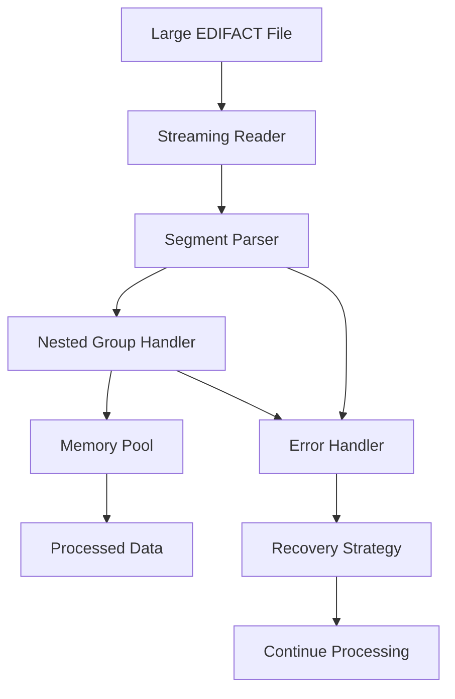

# Lesson 1: Advanced Message Handling

## 🎯 Learning Objectives

By the end of this lesson, you will understand:
- ✅ Complex message structures and nested segment groups
- ✅ Large file processing and memory management
- ✅ Streaming processing for high-volume scenarios
- ✅ Edge case handling and robust parsing

## 🔍 Advanced Message Processing

Building upon fundamental knowledge, this lesson covers sophisticated techniques for handling complex EDIFACT messages in production environments.

### Complex Message Structures

Advanced EDIFACT messages often contain:
- **Nested Segment Groups**: Hierarchical data structures
- **Large File Processing**: Handling files with thousands of segments
- **Memory-Efficient Parsing**: Processing without loading entire files into memory
- **Edge Case Handling**: Robust parsing of malformed or incomplete messages

## 🗺️ Mermaid Diagram: Advanced Processing Flow



## 🔧 Advanced Features

### 1. Streaming Processing
```go
// Process large files without loading into memory
reader := edifact.NewStreamingReader(file)
for reader.Next() {
    segment := reader.Current()
    // Process segment
}
```

### 2. Nested Segment Groups
```go
// Handle complex hierarchical structures
type InvoiceGroup struct {
    Header    *InvoiceHeader
    LineItems []*LineItemGroup
    Summary   *InvoiceSummary
}
```

### 3. Memory Management
```go
// Use object pools for high-performance scenarios
pool := sync.Pool{
    New: func() interface{} {
        return &Segment{}
    },
}
```

## 🛠️ Running the Examples

### Prerequisites
```bash
# Ensure you're in the lesson directory
cd examples/course/lesson1
```

### Basic Examples
```bash
# Run the main lesson
go run main.go
```

### What You'll See
The examples demonstrate:
- Complex message parsing with nested structures
- Large file processing techniques
- Memory optimization strategies
- Error handling for edge cases

## 💡 Key Concepts Explained

### 1. Streaming vs. Buffered Processing
- **Streaming**: Process data as it arrives, minimal memory usage
- **Buffered**: Load entire file into memory, faster for small files
- **Hybrid**: Combine both approaches based on file size

### 2. Nested Segment Groups
- **Parent-Child Relationships**: Handle hierarchical data structures
- **Group Boundaries**: Identify start and end of logical groups
- **Context Management**: Maintain state across group processing

### 3. Memory Optimization
- **Object Pooling**: Reuse objects to reduce GC pressure
- **Lazy Evaluation**: Process data only when needed
- **Chunked Processing**: Handle large files in manageable chunks

## 🧪 Practice Exercises

### Exercise 1: Large File Processing
Create a program that processes a 100MB EDIFACT file using streaming:
```go
// Your implementation here
```

### Exercise 2: Nested Group Handling
Implement a handler for complex nested segment groups:
```go
// Handle INVOIC with multiple line items and nested references
```

### Exercise 3: Memory Profiling
Profile your application and optimize memory usage:
```bash
go run -memprofile=mem.prof main.go
go tool pprof mem.prof
```

## ⚠️ Common Challenges

1. **Memory Leaks**: Ensure proper cleanup in long-running processes
2. **Performance Bottlenecks**: Profile and optimize critical paths
3. **Error Recovery**: Implement robust error handling for malformed data
4. **State Management**: Maintain context across complex processing flows

## 🔍 Troubleshooting

### Performance Issues
- Use profiling tools to identify bottlenecks
- Implement object pooling for frequently allocated objects
- Consider concurrent processing for independent segments

### Memory Issues
- Monitor memory usage with pprof
- Implement streaming for large files
- Use weak references for cached data

### Error Handling
- Implement circuit breakers for external dependencies
- Use exponential backoff for retry logic
- Log errors with sufficient context for debugging

## 📚 Next Steps

After completing this lesson:
1. Practice with real large EDIFACT files
2. Implement memory profiling in your applications
3. Experiment with different processing strategies
4. Move to Lesson 2: Custom Message Handlers

## 🎯 Key Takeaways

- ✅ Streaming processing is essential for large files
- ✅ Nested segment groups require careful state management
- ✅ Memory optimization is crucial for production systems
- ✅ Robust error handling ensures system reliability
- ✅ Profiling helps identify and fix performance issues

---

*Ready for the next lesson? Let's create custom message handlers! 🚀* 