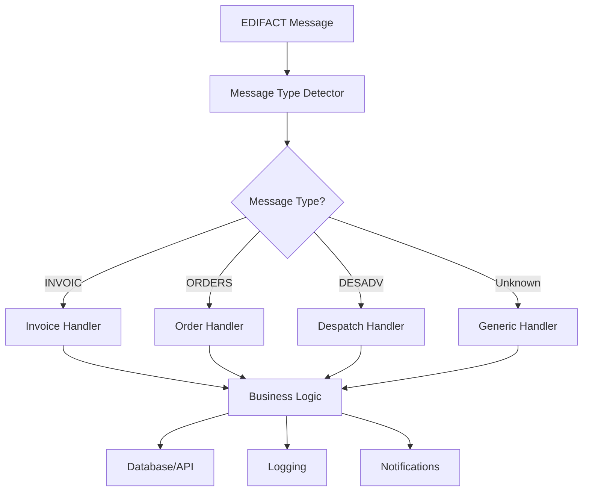

# Lesson 2: Custom Message Handlers

## 🎯 Learning Objectives

By the end of this lesson, you will understand:
- ✅ Creating custom message handlers for specific business requirements
- ✅ Integrating business logic with EDI processing
- ✅ Implementing message routing and dispatching
- ✅ Building extensible handler architectures

## 🔍 Custom Message Handlers

Custom handlers allow you to process EDIFACT messages according to your specific business rules and requirements. This lesson covers advanced techniques for creating flexible, maintainable, and powerful message processing systems.

### Handler Architecture

Advanced handler systems typically include:
- **Message Type Detection**: Automatically identify and route messages
- **Business Logic Integration**: Apply domain-specific processing rules
- **Handler Composition**: Combine multiple handlers for complex workflows
- **Extensibility**: Easy addition of new message types and handlers

## 🗺️ Mermaid Diagram: Custom Handler Flow



## 🔧 Advanced Handler Features

### 1. Message Type Detection
```go
type MessageDetector struct {
    handlers map[string]MessageHandler
    fallback MessageHandler
}

func (md *MessageDetector) DetectAndRoute(message *EDIFACTMessage) error {
    msgType := md.extractMessageType(message)
    if handler, exists := md.handlers[msgType]; exists {
        return handler.Process(message)
    }
    return md.fallback.Process(message)
}
```

### 2. Business Logic Integration
```go
type InvoiceHandler struct {
    validator  *InvoiceValidator
    processor  *InvoiceProcessor
    notifier   *NotificationService
    repository *InvoiceRepository
}

func (h *InvoiceHandler) Process(message *EDIFACTMessage) error {
    // Extract invoice data
    invoice := h.extractInvoice(message)
    
    // Validate business rules
    if err := h.validator.Validate(invoice); err != nil {
        return err
    }
    
    // Process invoice
    result := h.processor.Process(invoice)
    
    // Store in database
    if err := h.repository.Save(result); err != nil {
        return err
    }
    
    // Send notifications
    return h.notifier.Notify(result)
}
```

### 3. Handler Composition
```go
type CompositeHandler struct {
    handlers []MessageHandler
}

func (ch *CompositeHandler) Process(message *EDIFACTMessage) error {
    for _, handler := range ch.handlers {
        if err := handler.Process(message); err != nil {
            return err
        }
    }
    return nil
}
```

## 🛠️ Running the Examples

### Prerequisites
```bash
# Ensure you're in the lesson directory
cd examples/course/lesson2
```

### Basic Examples
```bash
# Run the main lesson
go run main.go
```

### What You'll See
The examples demonstrate:
- Custom handler creation and registration
- Message type detection and routing
- Business logic integration
- Handler composition patterns

## 💡 Key Concepts Explained

### 1. Handler Interface Design
- **Single Responsibility**: Each handler has one clear purpose
- **Dependency Injection**: Handlers receive dependencies through constructors
- **Error Handling**: Consistent error handling across all handlers
- **Logging**: Comprehensive logging for debugging and monitoring

### 2. Message Routing
- **Type-Based Routing**: Route messages based on message type
- **Content-Based Routing**: Route based on message content
- **Priority Routing**: Handle high-priority messages first
- **Load Balancing**: Distribute processing across multiple handlers

### 3. Business Logic Integration
- **Validation**: Apply business rules and constraints
- **Transformation**: Convert EDI data to business objects
- **Enrichment**: Add additional data from external sources
- **Orchestration**: Coordinate multiple business processes

## 🧪 Practice Exercises

### Exercise 1: Create Custom Invoice Handler
Implement a handler for INVOIC messages with business validation:
```go
type InvoiceHandler struct {
    // Your implementation here
}

func (h *InvoiceHandler) Process(message *EDIFACTMessage) error {
    // Extract and validate invoice data
    // Apply business rules
    // Store in database
    // Send notifications
}
```

### Exercise 2: Implement Message Router
Create a router that can handle multiple message types:
```go
type MessageRouter struct {
    handlers map[string]MessageHandler
}

func (r *MessageRouter) Route(message *EDIFACTMessage) error {
    // Detect message type
    // Route to appropriate handler
    // Handle unknown message types
}
```

### Exercise 3: Handler Composition
Build a composite handler that applies multiple processing steps:
```go
type ProcessingPipeline struct {
    steps []MessageHandler
}

func (p *ProcessingPipeline) Process(message *EDIFACTMessage) error {
    // Apply each processing step in sequence
    // Handle errors appropriately
    // Provide rollback capabilities
}
```

## ⚠️ Common Challenges

1. **Handler Coupling**: Avoid tight coupling between handlers and business logic
2. **Error Propagation**: Ensure errors are properly handled and logged
3. **Performance**: Optimize handler performance for high-throughput scenarios
4. **Testing**: Create comprehensive tests for complex handler logic

## 🔍 Troubleshooting

### Handler Registration Issues
- Use dependency injection for handler registration
- Implement handler validation during registration
- Provide clear error messages for missing handlers

### Performance Problems
- Profile handler performance individually
- Implement caching for expensive operations
- Use concurrent processing where appropriate

### Business Logic Errors
- Implement comprehensive validation
- Add detailed logging for debugging
- Create rollback mechanisms for failed operations

## 📚 Next Steps

After completing this lesson:
1. Create handlers for your specific business requirements
2. Implement comprehensive testing for your handlers
3. Add monitoring and metrics to your handler system
4. Move to Lesson 3: Performance Optimization

## 🎯 Key Takeaways

- ✅ Custom handlers enable business-specific EDI processing
- ✅ Message routing provides flexibility and extensibility
- ✅ Business logic integration ensures data consistency
- ✅ Handler composition supports complex workflows
- ✅ Proper design patterns ensure maintainability

---

*Ready for the next lesson? Let's optimize performance! 🚀* 