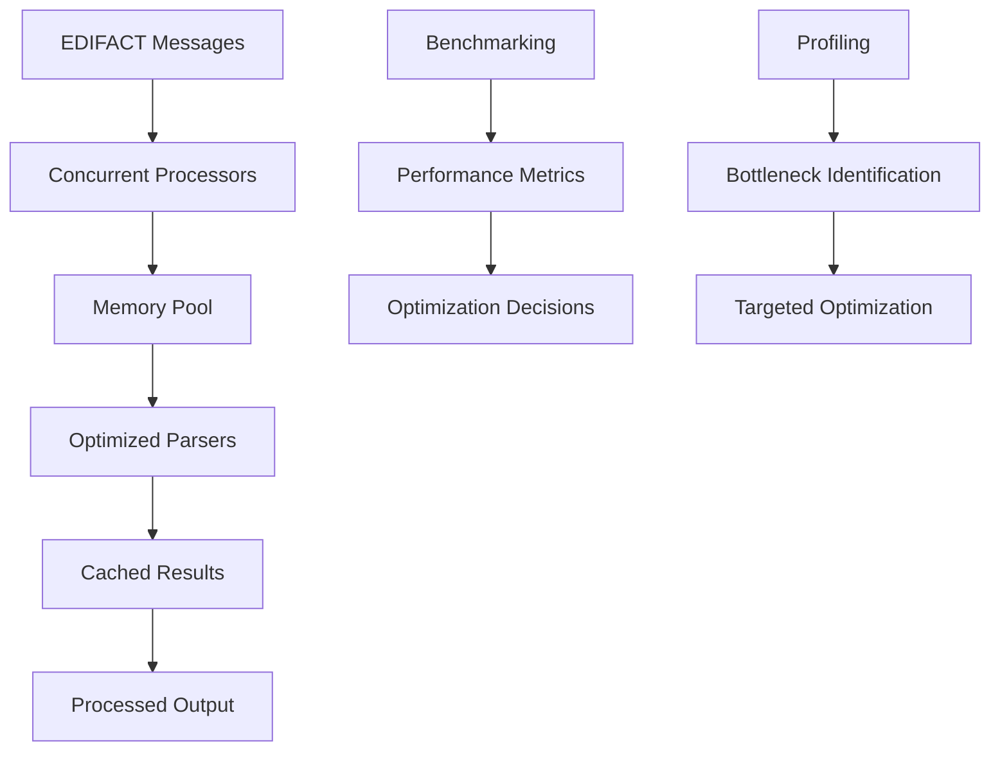

# Lesson 3: Performance Optimization

## 🎯 Learning Objectives

By the end of this lesson, you will understand:
- ✅ Memory optimization techniques for high-throughput EDI processing
- ✅ Concurrent processing strategies for parallel message handling
- ✅ Benchmarking and profiling to identify performance bottlenecks
- ✅ Caching strategies and lazy evaluation patterns

## 🔍 Performance Optimization

Performance optimization is crucial for production EDI systems that process thousands of messages per second. This lesson covers advanced techniques for maximizing throughput while minimizing resource usage.

### Optimization Areas

Key areas for EDI performance optimization:
- **Memory Management**: Reduce allocations and GC pressure
- **Concurrent Processing**: Parallelize independent operations
- **I/O Optimization**: Efficient file and network operations
- **Algorithm Optimization**: Choose optimal parsing strategies

## 🗺️ Mermaid Diagram: Performance Optimization Flow



## 🔧 Advanced Optimization Features

### 1. Memory Pooling
```go
type SegmentPool struct {
    pool sync.Pool
}

func NewSegmentPool() *SegmentPool {
    return &SegmentPool{
        pool: sync.Pool{
            New: func() interface{} {
                return &Segment{
                    Elements: make([]string, 0, 10), // Pre-allocate
                }
            },
        },
    }
}

func (sp *SegmentPool) Get() *Segment {
    return sp.pool.Get().(*Segment)
}

func (sp *SegmentPool) Put(segment *Segment) {
    // Reset for reuse
    segment.Tag = ""
    segment.Elements = segment.Elements[:0]
    sp.pool.Put(segment)
}
```

### 2. Concurrent Processing
```go
type ConcurrentProcessor struct {
    workers    int
    jobQueue   chan *ProcessingJob
    resultChan chan *ProcessingResult
}

func (cp *ConcurrentProcessor) Process(messages []string) []*ProcessingResult {
    // Start workers
    for i := 0; i < cp.workers; i++ {
        go cp.worker()
    }
    
    // Submit jobs
    for _, msg := range messages {
        cp.jobQueue <- &ProcessingJob{Message: msg}
    }
    
    // Collect results
    results := make([]*ProcessingResult, 0, len(messages))
    for i := 0; i < len(messages); i++ {
        result := <-cp.resultChan
        results = append(results, result)
    }
    
    return results
}
```

### 3. Caching Strategies
```go
type MessageCache struct {
    cache map[string]*CachedMessage
    mu    sync.RWMutex
    ttl   time.Duration
}

func (mc *MessageCache) Get(key string) (*CachedMessage, bool) {
    mc.mu.RLock()
    defer mc.mu.RUnlock()
    
    if cached, exists := mc.cache[key]; exists && !cached.Expired() {
        return cached, true
    }
    return nil, false
}

func (mc *MessageCache) Set(key string, message *CachedMessage) {
    mc.mu.Lock()
    defer mc.mu.Unlock()
    
    mc.cache[key] = message
}
```

## 🛠️ Running the Examples

### Prerequisites
```bash
# Ensure you're in the lesson directory
cd examples/course/lesson3
```

### Basic Examples
```bash
# Run the main lesson
go run main.go
```

### Performance Testing
```bash
# Run benchmarks
go test -bench=.
```

### Memory Profiling
```bash
# Generate memory profile
go run -memprofile=mem.prof main.go
go tool pprof mem.prof
```

### What You'll See
The examples demonstrate:
- Memory pooling and object reuse
- Concurrent message processing
- Caching strategies
- Performance benchmarking
- Memory profiling

## 💡 Key Concepts Explained

### 1. Memory Optimization
- **Object Pooling**: Reuse objects to reduce GC pressure
- **Pre-allocation**: Allocate slices and maps with known capacity
- **String Interning**: Reuse common strings
- **Lazy Evaluation**: Process data only when needed

### 2. Concurrent Processing
- **Worker Pools**: Reuse goroutines for processing
- **Job Queues**: Distribute work across workers
- **Result Aggregation**: Collect results from concurrent operations
- **Synchronization**: Use appropriate sync primitives

### 3. Caching Strategies
- **LRU Cache**: Least Recently Used eviction
- **TTL Cache**: Time-based expiration
- **Write-Through**: Immediate cache updates
- **Write-Behind**: Batched cache updates

## 🧪 Practice Exercises

### Exercise 1: Memory Pool Implementation
Create a memory pool for EDIFACT segments:
```go
type SegmentPool struct {
    // Your implementation here
}

func (sp *SegmentPool) Get() *Segment {
    // Get segment from pool or create new
}

func (sp *SegmentPool) Put(segment *Segment) {
    // Return segment to pool
}
```

### Exercise 2: Concurrent Processor
Implement a concurrent message processor:
```go
type ConcurrentProcessor struct {
    workers int
    // Your implementation here
}

func (cp *ConcurrentProcessor) Process(messages []string) []Result {
    // Process messages concurrently
    // Use worker pools
    // Aggregate results
}
```

### Exercise 3: Performance Benchmarking
Create benchmarks for different processing strategies:
```go
func BenchmarkSequentialProcessing(b *testing.B) {
    // Benchmark sequential processing
}

func BenchmarkConcurrentProcessing(b *testing.B) {
    // Benchmark concurrent processing
}

func BenchmarkPooledProcessing(b *testing.B) {
    // Benchmark with object pooling
}
```

## ⚠️ Common Performance Issues

1. **Memory Leaks**: Ensure proper cleanup in long-running processes
2. **Goroutine Leaks**: Limit concurrent operations and use timeouts
3. **Cache Thrashing**: Use appropriate cache sizes and eviction policies
4. **Lock Contention**: Minimize critical sections and use read-write locks

## 🔍 Troubleshooting

### Memory Issues
- Use `go tool pprof` to identify memory hotspots
- Implement object pooling for frequently allocated objects
- Monitor GC pressure and adjust accordingly

### Concurrency Issues
- Use `go test -race` to detect race conditions
- Implement proper synchronization
- Use context cancellation for graceful shutdown

### Performance Bottlenecks
- Profile CPU usage with `go tool pprof`
- Identify hot paths and optimize
- Use benchmarks to measure improvements

## 📚 Next Steps

After completing this lesson:
1. Implement performance monitoring in your applications
2. Profile and optimize critical paths
3. Add concurrent processing where appropriate
4. Move to Lesson 4: Error Handling & Recovery

## 🎯 Key Takeaways

- ✅ Memory optimization is crucial for high-throughput systems
- ✅ Concurrent processing can significantly improve performance
- ✅ Caching reduces redundant computation
- ✅ Benchmarking helps measure optimization effectiveness
- ✅ Profiling identifies performance bottlenecks

---

*Ready for the next lesson? Let's implement robust error handling! 🚀* 