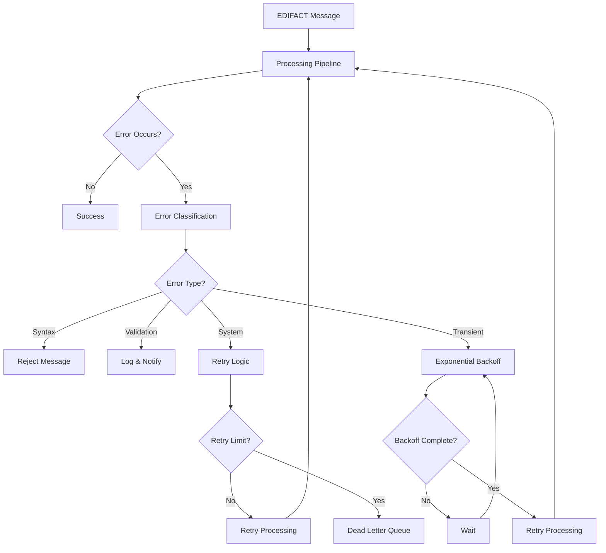

# Lesson 4: Error Handling & Recovery

## 🎯 Learning Objectives

By the end of this lesson, you will understand:
- ✅ Error classification and categorization for EDI processing
- ✅ Recovery strategies and retry mechanisms
- ✅ Comprehensive logging and monitoring systems
- ✅ Circuit breaker patterns and fault tolerance

## 🔍 Error Handling & Recovery

Robust error handling is essential for production EDI systems that must process messages reliably even when encountering various types of failures. This lesson covers advanced error handling patterns and recovery strategies.

### Error Categories

EDI processing errors can be categorized as:
- **Syntax Errors**: Malformed EDIFACT messages
- **Validation Errors**: Business rule violations
- **System Errors**: Infrastructure and resource failures
- **Transient Errors**: Temporary issues that may resolve

## 🗺️ Mermaid Diagram: Error Handling Flow



## 🔧 Advanced Error Handling Features

### 1. Error Classification
```go
type ErrorType int

const (
    ErrorTypeSyntax ErrorType = iota
    ErrorTypeValidation
    ErrorTypeSystem
    ErrorTypeTransient
)

type ProcessingError struct {
    Type        ErrorType
    Message     string
    Segment     string
    Position    int
    Retryable   bool
    Timestamp   time.Time
}

func (e *ProcessingError) Error() string {
    return fmt.Sprintf("[%s] %s at position %d: %s", 
        e.Type.String(), e.Segment, e.Position, e.Message)
}
```

### 2. Retry Logic with Exponential Backoff
```go
type RetryHandler struct {
    maxRetries    int
    baseDelay     time.Duration
    maxDelay      time.Duration
    backoffFactor float64
}

func (rh *RetryHandler) ExecuteWithRetry(operation func() error) error {
    var lastErr error
    
    for attempt := 0; attempt <= rh.maxRetries; attempt++ {
        if err := operation(); err == nil {
            return nil
        } else {
            lastErr = err
        }
        
        if attempt < rh.maxRetries {
            delay := rh.calculateDelay(attempt)
            time.Sleep(delay)
        }
    }
    
    return fmt.Errorf("operation failed after %d attempts: %w", 
        rh.maxRetries+1, lastErr)
}

func (rh *RetryHandler) calculateDelay(attempt int) time.Duration {
    delay := time.Duration(float64(rh.baseDelay) * 
        math.Pow(rh.backoffFactor, float64(attempt)))
    if delay > rh.maxDelay {
        delay = rh.maxDelay
    }
    return delay
}
```

### 3. Circuit Breaker Pattern
```go
type CircuitBreaker struct {
    failureThreshold int
    timeout          time.Duration
    state            CircuitState
    failureCount     int
    lastFailureTime  time.Time
    mu               sync.RWMutex
}

type CircuitState int

const (
    StateClosed CircuitState = iota
    StateOpen
    StateHalfOpen
)

func (cb *CircuitBreaker) Execute(operation func() error) error {
    if !cb.canExecute() {
        return fmt.Errorf("circuit breaker is open")
    }
    
    err := operation()
    cb.recordResult(err)
    return err
}

func (cb *CircuitBreaker) canExecute() bool {
    cb.mu.RLock()
    defer cb.mu.RUnlock()
    
    switch cb.state {
    case StateClosed:
        return true
    case StateOpen:
        if time.Since(cb.lastFailureTime) > cb.timeout {
            cb.mu.RUnlock()
            cb.mu.Lock()
            cb.state = StateHalfOpen
            cb.mu.Unlock()
            cb.mu.RLock()
            return true
        }
        return false
    case StateHalfOpen:
        return true
    default:
        return false
    }
}
```

## 🛠️ Running the Examples

### Prerequisites
```bash
# Ensure you're in the lesson directory
cd examples/course/lesson4
```

### Basic Examples
```bash
# Run the main lesson
go run main.go
```

### What You'll See
The examples demonstrate:
- Error classification and handling
- Retry logic with exponential backoff
- Circuit breaker implementation
- Comprehensive logging
- Recovery strategies

## 💡 Key Concepts Explained

### 1. Error Classification
- **Syntax Errors**: Invalid EDIFACT format, missing delimiters
- **Validation Errors**: Business rule violations, invalid codes
- **System Errors**: Database failures, network timeouts
- **Transient Errors**: Temporary resource unavailability

### 2. Recovery Strategies
- **Immediate Retry**: For transient errors
- **Exponential Backoff**: For persistent issues
- **Dead Letter Queue**: For unrecoverable errors
- **Manual Intervention**: For complex error scenarios

### 3. Monitoring and Alerting
- **Error Rate Monitoring**: Track error frequencies
- **Performance Metrics**: Monitor processing times
- **Alert Thresholds**: Notify when error rates exceed limits
- **Error Correlation**: Group related errors

## 🧪 Practice Exercises

### Exercise 1: Error Classifier
Implement an error classifier for EDI processing:
```go
type ErrorClassifier struct {
    // Your implementation here
}

func (ec *ErrorClassifier) Classify(err error) ErrorType {
    // Analyze error and return appropriate type
}

func (ec *ErrorClassifier) IsRetryable(err error) bool {
    // Determine if error is retryable
}
```

### Exercise 2: Retry Handler
Create a retry handler with exponential backoff:
```go
type RetryHandler struct {
    maxRetries int
    baseDelay  time.Duration
    // Your implementation here
}

func (rh *RetryHandler) ExecuteWithRetry(operation func() error) error {
    // Implement retry logic with exponential backoff
}
```

### Exercise 3: Circuit Breaker
Implement a circuit breaker pattern:
```go
type CircuitBreaker struct {
    failureThreshold int
    timeout          time.Duration
    // Your implementation here
}

func (cb *CircuitBreaker) Execute(operation func() error) error {
    // Implement circuit breaker logic
}
```

## ⚠️ Common Error Handling Mistakes

1. **Silent Failures**: Always log errors with sufficient context
2. **Infinite Retries**: Set appropriate retry limits
3. **No Error Classification**: Categorize errors for appropriate handling
4. **Missing Monitoring**: Implement comprehensive error monitoring

## 🔍 Troubleshooting

### Error Handling Issues
- Implement structured logging for better error analysis
- Use error wrapping to preserve context
- Create error dashboards for monitoring

### Recovery Problems
- Test recovery mechanisms with simulated failures
- Implement graceful degradation for partial failures
- Use health checks to verify system recovery

### Monitoring Challenges
- Set up alerting for critical error thresholds
- Implement error rate tracking
- Create error correlation analysis

## 📚 Next Steps

After completing this lesson:
1. Implement comprehensive error handling in your applications
2. Set up monitoring and alerting systems
3. Test error recovery mechanisms
4. Move to Lesson 5: Integration Patterns

## 🎯 Key Takeaways

- ✅ Proper error classification enables appropriate handling
- ✅ Retry logic with exponential backoff handles transient failures
- ✅ Circuit breakers prevent cascading failures
- ✅ Comprehensive logging enables effective debugging
- ✅ Monitoring and alerting ensure system reliability

---

*Ready for the next lesson? Let's explore integration patterns! 🚀* 