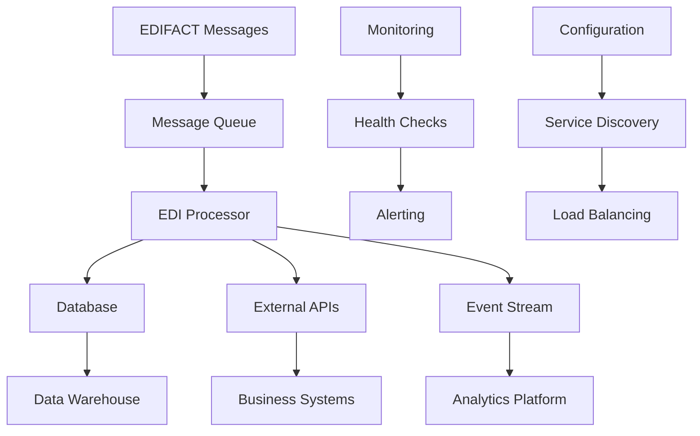

# Lesson 5: Integration Patterns

## 🎯 Learning Objectives

By the end of this lesson, you will understand:
- ✅ Database integration patterns for EDI data persistence
- ✅ API communication strategies for external system integration
- ✅ Message queuing for asynchronous processing
- ✅ Event-driven architecture for EDI systems

## 🔍 Integration Patterns

Modern EDI systems must integrate with various external systems, databases, and services. This lesson covers advanced integration patterns that enable scalable, reliable, and maintainable EDI processing systems.

### Integration Types

Common integration patterns in EDI systems:
- **Database Integration**: Persistent storage of EDI data
- **API Integration**: Communication with external services
- **Message Queuing**: Asynchronous processing and reliability
- **Event Streaming**: Real-time data processing and analytics

## 🗺️ Mermaid Diagram: Integration Architecture



## 🔧 Advanced Integration Features

### 1. Database Integration
```go
type DatabaseIntegration struct {
    db        *sql.DB
    cache     *Cache
    migrations *MigrationManager
}

type EDIRepository struct {
    db *sql.DB
}

func (r *EDIRepository) SaveMessage(message *EDIMessage) error {
    tx, err := r.db.Begin()
    if err != nil {
        return err
    }
    defer tx.Rollback()
    
    // Save message header
    headerID, err := r.saveHeader(tx, message.Header)
    if err != nil {
        return err
    }
    
    // Save segments
    for _, segment := range message.Segments {
        if err := r.saveSegment(tx, headerID, segment); err != nil {
            return err
        }
    }
    
    return tx.Commit()
}

func (r *EDIRepository) saveHeader(tx *sql.Tx, header *MessageHeader) (int64, error) {
    result, err := tx.Exec(`
        INSERT INTO edi_messages (message_type, sender, receiver, timestamp)
        VALUES (?, ?, ?, ?)
    `, header.Type, header.Sender, header.Receiver, header.Timestamp)
    if err != nil {
        return 0, err
    }
    return result.LastInsertId()
}
```

### 2. API Integration
```go
type APIIntegration struct {
    client    *http.Client
    rateLimit *RateLimiter
    circuit   *CircuitBreaker
}

type ExternalServiceClient struct {
    baseURL    string
    client     *http.Client
    authToken  string
}

func (c *ExternalServiceClient) SendNotification(notification *Notification) error {
    payload, err := json.Marshal(notification)
    if err != nil {
        return err
    }
    
    req, err := http.NewRequest("POST", c.baseURL+"/notifications", bytes.NewBuffer(payload))
    if err != nil {
        return err
    }
    
    req.Header.Set("Authorization", "Bearer "+c.authToken)
    req.Header.Set("Content-Type", "application/json")
    
    resp, err := c.client.Do(req)
    if err != nil {
        return err
    }
    defer resp.Body.Close()
    
    if resp.StatusCode >= 400 {
        return fmt.Errorf("API request failed with status: %d", resp.StatusCode)
    }
    
    return nil
}
```

### 3. Message Queuing
```go
type MessageQueue struct {
    producer   *Producer
    consumer   *Consumer
    deadLetter *DeadLetterQueue
}

type Producer struct {
    queue    *Queue
    retry    *RetryHandler
    circuit  *CircuitBreaker
}

func (p *Producer) SendMessage(message *EDIMessage) error {
    return p.circuit.Execute(func() error {
        payload, err := json.Marshal(message)
        if err != nil {
            return err
        }
        
        return p.queue.Publish("edi.messages", payload)
    })
}

type Consumer struct {
    queue     *Queue
    processor *MessageProcessor
    workers   int
}

func (c *Consumer) Start() error {
    for i := 0; i < c.workers; i++ {
        go c.worker()
    }
    return nil
}

func (c *Consumer) worker() {
    for {
        message, err := c.queue.Consume("edi.messages")
        if err != nil {
            log.Printf("Error consuming message: %v", err)
            continue
        }
        
        if err := c.processor.Process(message); err != nil {
            log.Printf("Error processing message: %v", err)
            c.deadLetter.Send(message)
        }
    }
}
```

## 🛠️ Running the Examples

### Prerequisites
```bash
# Ensure you're in the lesson directory
cd examples/course/lesson5
```

### Basic Examples
```bash
# Run the main lesson
go run main.go
```

### What You'll See
The examples demonstrate:
- Database integration patterns
- API communication strategies
- Message queuing implementation
- Event-driven processing
- Service discovery and load balancing

## 💡 Key Concepts Explained

### 1. Database Integration
- **Transaction Management**: Ensure data consistency
- **Connection Pooling**: Optimize database performance
- **Migration Management**: Handle schema changes
- **Caching Strategies**: Reduce database load

### 2. API Integration
- **Rate Limiting**: Respect API limits
- **Authentication**: Secure API communication
- **Retry Logic**: Handle transient failures
- **Circuit Breakers**: Prevent cascading failures

### 3. Message Queuing
- **Asynchronous Processing**: Improve system responsiveness
- **Reliability**: Ensure message delivery
- **Scalability**: Handle high message volumes
- **Dead Letter Queues**: Handle failed messages

## 🧪 Practice Exercises

### Exercise 1: Database Integration
Implement a database repository for EDI messages:
```go
type EDIRepository struct {
    db *sql.DB
}

func (r *EDIRepository) SaveMessage(message *EDIMessage) error {
    // Implement transaction-based message saving
}

func (r *EDIRepository) GetMessage(id string) (*EDIMessage, error) {
    // Implement message retrieval with joins
}
```

### Exercise 2: API Client
Create an API client for external service integration:
```go
type ExternalAPIClient struct {
    baseURL   string
    client    *http.Client
    rateLimit *RateLimiter
}

func (c *ExternalAPIClient) SendData(data interface{}) error {
    // Implement API communication with retry logic
}
```

### Exercise 3: Message Queue
Implement a simple message queue:
```go
type MessageQueue struct {
    messages chan *Message
    workers  int
}

func (mq *MessageQueue) Start() {
    // Start worker goroutines
}

func (mq *MessageQueue) Send(message *Message) error {
    // Send message to queue
}
```

## ⚠️ Common Integration Challenges

1. **Data Consistency**: Ensure consistency across multiple systems
2. **Performance**: Optimize integration performance
3. **Reliability**: Handle integration failures gracefully
4. **Security**: Secure data transmission and storage

## 🔍 Troubleshooting

### Database Issues
- Monitor connection pool usage
- Implement proper error handling
- Use database-specific optimizations

### API Integration Problems
- Implement proper authentication
- Handle rate limiting gracefully
- Monitor API response times

### Message Queue Issues
- Monitor queue depths
- Implement dead letter handling
- Ensure message ordering when required

## 📚 Next Steps

After completing this lesson:
1. Implement integration patterns in your applications
2. Set up monitoring for integration points
3. Test integration reliability
4. Move to Lesson 6: Advanced Validation

## 🎯 Key Takeaways

- ✅ Database integration ensures data persistence and consistency
- ✅ API integration enables communication with external systems
- ✅ Message queuing provides reliability and scalability
- ✅ Event-driven architecture supports real-time processing
- ✅ Proper integration patterns ensure system reliability

---

*Ready for the next lesson? Let's implement advanced validation! 🚀* 