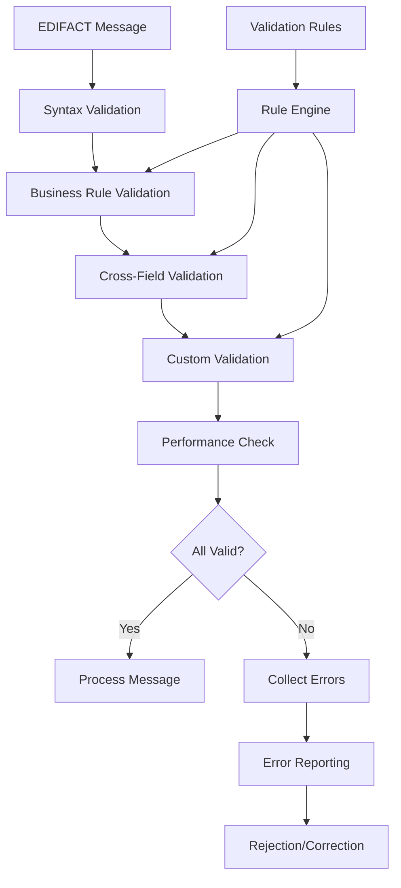

# Lesson 6: Advanced Validation

## 🎯 Learning Objectives

By the end of this lesson, you will understand:
- ✅ Business rule validation for complex EDI scenarios
- ✅ Cross-field validation and dependency checking
- ✅ Custom validator creation and composition
- ✅ Validation performance optimization

## 🔍 Advanced Validation

Advanced validation goes beyond basic syntax checking to ensure that EDI messages comply with business rules, industry standards, and organizational requirements. This lesson covers sophisticated validation techniques for production EDI systems.

### Validation Types

Advanced EDI validation includes:
- **Business Rule Validation**: Domain-specific rules and constraints
- **Cross-Field Validation**: Dependencies between different fields
- **Custom Validators**: Specialized validation logic
- **Performance Validation**: Ensuring validation doesn't impact throughput

## 🗺️ Mermaid Diagram: Advanced Validation Flow



## 🔧 Advanced Validation Features

### 1. Business Rule Validation
```go
type BusinessRuleValidator struct {
    rules map[string]ValidationRule
    cache *ValidationCache
}

type ValidationRule interface {
    Validate(message *EDIMessage) error
    GetRuleID() string
    GetSeverity() ValidationSeverity
}

type InvoiceValidationRule struct {
    ruleID string
}

func (r *InvoiceValidationRule) Validate(message *EDIMessage) error {
    if message.Type != "INVOIC" {
        return nil // Not applicable
    }
    
    // Extract invoice data
    invoice := r.extractInvoice(message)
    
    // Validate business rules
    if err := r.validateAmount(invoice); err != nil {
        return fmt.Errorf("amount validation failed: %w", err)
    }
    
    if err := r.validateDates(invoice); err != nil {
        return fmt.Errorf("date validation failed: %w", err)
    }
    
    if err := r.validateLineItems(invoice); err != nil {
        return fmt.Errorf("line item validation failed: %w", err)
    }
    
    return nil
}

func (r *InvoiceValidationRule) validateAmount(invoice *Invoice) error {
    if invoice.TotalAmount <= 0 {
        return fmt.Errorf("invoice amount must be positive")
    }
    
    calculatedTotal := r.calculateLineItemTotal(invoice.LineItems)
    if math.Abs(invoice.TotalAmount-calculatedTotal) > 0.01 {
        return fmt.Errorf("invoice total doesn't match line item sum")
    }
    
    return nil
}
```

### 2. Cross-Field Validation
```go
type CrossFieldValidator struct {
    dependencies map[string][]string
    validators   map[string]CrossFieldRule
}

type CrossFieldRule interface {
    Validate(fields map[string]interface{}) error
    GetDependencies() []string
}

type DateRangeValidator struct {
    startDateField string
    endDateField   string
}

func (v *DateRangeValidator) Validate(fields map[string]interface{}) error {
    startDate, startOK := fields[v.startDateField].(time.Time)
    endDate, endOK := fields[v.endDateField].(time.Time)
    
    if !startOK || !endOK {
        return fmt.Errorf("date fields not found or invalid")
    }
    
    if endDate.Before(startDate) {
        return fmt.Errorf("end date cannot be before start date")
    }
    
    return nil
}

func (v *DateRangeValidator) GetDependencies() []string {
    return []string{v.startDateField, v.endDateField}
}
```

### 3. Custom Validators
```go
type CustomValidator struct {
    validators []Validator
    pipeline   *ValidationPipeline
}

type Validator interface {
    Validate(data interface{}) error
    GetName() string
}

type CurrencyValidator struct {
    allowedCurrencies map[string]bool
}

func (v *CurrencyValidator) Validate(data interface{}) error {
    currency, ok := data.(string)
    if !ok {
        return fmt.Errorf("currency must be a string")
    }
    
    if !v.allowedCurrencies[currency] {
        return fmt.Errorf("currency %s is not supported", currency)
    }
    
    return nil
}

type TaxCodeValidator struct {
    taxCodes map[string]TaxCodeInfo
}

func (v *TaxCodeValidator) Validate(data interface{}) error {
    taxCode, ok := data.(string)
    if !ok {
        return fmt.Errorf("tax code must be a string")
    }
    
    if info, exists := v.taxCodes[taxCode]; !exists {
        return fmt.Errorf("invalid tax code: %s", taxCode)
    } else if !info.Active {
        return fmt.Errorf("tax code %s is inactive", taxCode)
    }
    
    return nil
}
```

## 🛠️ Running the Examples

### Prerequisites
```bash
# Ensure you're in the lesson directory
cd examples/course/lesson6
```

### Basic Examples
```bash
# Run the main lesson
go run main.go
```

### What You'll See
The examples demonstrate:
- Business rule validation implementation
- Cross-field validation strategies
- Custom validator creation
- Validation performance optimization
- Error collection and reporting

## 💡 Key Concepts Explained

### 1. Business Rule Validation
- **Domain Rules**: Industry-specific validation requirements
- **Organizational Rules**: Company-specific business logic
- **Regulatory Compliance**: Legal and regulatory requirements
- **Data Integrity**: Ensuring data consistency and accuracy

### 2. Cross-Field Validation
- **Dependency Management**: Handling field relationships
- **Conditional Validation**: Rules that depend on other fields
- **Consistency Checking**: Ensuring related fields are consistent
- **Constraint Validation**: Business constraints across multiple fields

### 3. Custom Validators
- **Extensibility**: Adding new validation rules
- **Composition**: Combining multiple validators
- **Performance**: Optimizing validation execution
- **Reusability**: Creating reusable validation components

## 🧪 Practice Exercises

### Exercise 1: Business Rule Validator
Implement a business rule validator for invoices:
```go
type InvoiceBusinessValidator struct {
    rules []BusinessRule
}

func (v *InvoiceBusinessValidator) Validate(invoice *Invoice) []ValidationError {
    var errors []ValidationError
    
    for _, rule := range v.rules {
        if err := rule.Validate(invoice); err != nil {
            errors = append(errors, ValidationError{
                Rule:    rule.GetRuleID(),
                Message: err.Error(),
            })
        }
    }
    
    return errors
}
```

### Exercise 2: Cross-Field Validator
Create a cross-field validator for date ranges:
```go
type DateRangeValidator struct {
    startField string
    endField   string
}

func (v *DateRangeValidator) Validate(data map[string]interface{}) error {
    // Implement cross-field date validation
}
```

### Exercise 3: Custom Validator Pipeline
Build a validation pipeline that combines multiple validators:
```go
type ValidationPipeline struct {
    validators []Validator
}

func (p *ValidationPipeline) Validate(data interface{}) []ValidationError {
    // Implement pipeline validation
}
```

## ⚠️ Common Validation Challenges

1. **Performance**: Ensure validation doesn't impact processing speed
2. **Complexity**: Manage complex business rules effectively
3. **Maintenance**: Keep validation rules up to date
4. **Error Reporting**: Provide clear, actionable error messages

## 🔍 Troubleshooting

### Validation Performance Issues
- Use caching for expensive validation operations
- Implement lazy validation where appropriate
- Profile validation performance and optimize bottlenecks

### Complex Rule Management
- Use rule engines for complex business logic
- Implement rule versioning and management
- Create comprehensive rule documentation

### Error Handling
- Collect all validation errors, not just the first one
- Provide context for validation failures
- Implement error categorization and prioritization

## 📚 Next Steps

After completing this lesson:
1. Implement comprehensive validation in your applications
2. Create custom validators for your business requirements
3. Set up validation monitoring and reporting
4. Move to Lesson 7: Real-world Applications

## 🎯 Key Takeaways

- ✅ Business rule validation ensures compliance with domain requirements
- ✅ Cross-field validation handles complex data relationships
- ✅ Custom validators provide flexibility and extensibility
- ✅ Validation performance optimization is crucial for production systems
- ✅ Comprehensive error reporting improves debugging and user experience

---

*Ready for the final lesson? Let's build real-world applications! 🚀* 