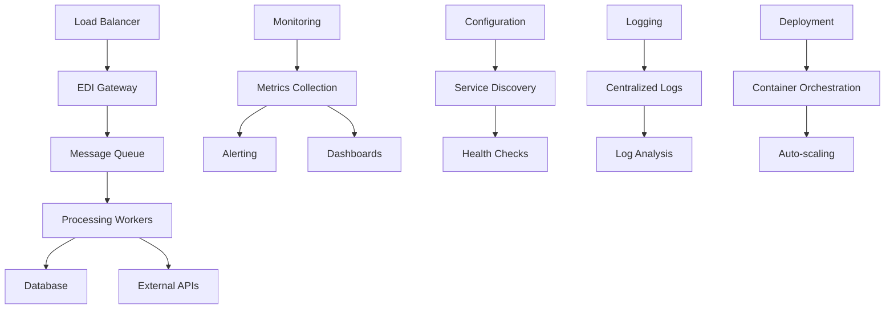

# Lesson 7: Real-world Applications

## 🎯 Learning Objectives

By the end of this lesson, you will understand:
- ✅ Building complete, production-ready EDI applications
- ✅ Deployment strategies and containerization
- ✅ Monitoring, logging, and observability
- ✅ Scaling and performance optimization for production

## 🔍 Real-world Applications

This final lesson brings together all the advanced concepts learned throughout the course to build a complete, production-ready EDI processing system. You'll learn how to deploy, monitor, and scale EDI applications in real-world environments.

### Production Requirements

Real-world EDI systems must meet:
- **High Availability**: 99.9%+ uptime requirements
- **Scalability**: Handle varying message volumes
- **Reliability**: Ensure message processing without loss
- **Observability**: Comprehensive monitoring and alerting

## 🗺️ Mermaid Diagram: Production Architecture



## 🔧 Production Application Features

### 1. Complete EDI Application
```go
type EDIApplication struct {
    config     *Config
    server     *HTTPServer
    processor  *MessageProcessor
    queue      *MessageQueue
    database   *Database
    monitoring *Monitoring
    logger     *Logger
}

type Config struct {
    Server   ServerConfig   `yaml:"server"`
    Database DatabaseConfig `yaml:"database"`
    Queue    QueueConfig    `yaml:"queue"`
    Monitoring MonitoringConfig `yaml:"monitoring"`
}

func NewEDIApplication(configPath string) (*EDIApplication, error) {
    config, err := loadConfig(configPath)
    if err != nil {
        return nil, err
    }
    
    app := &EDIApplication{
        config: config,
    }
    
    // Initialize components
    if err := app.initializeDatabase(); err != nil {
        return nil, err
    }
    
    if err := app.initializeQueue(); err != nil {
        return nil, err
    }
    
    if err := app.initializeProcessor(); err != nil {
        return nil, err
    }
    
    if err := app.initializeServer(); err != nil {
        return nil, err
    }
    
    if err := app.initializeMonitoring(); err != nil {
        return nil, err
    }
    
    return app, nil
}

func (app *EDIApplication) Start() error {
    // Start monitoring
    if err := app.monitoring.Start(); err != nil {
        return err
    }
    
    // Start message processor
    if err := app.processor.Start(); err != nil {
        return err
    }
    
    // Start HTTP server
    return app.server.Start()
}

func (app *EDIApplication) Stop() error {
    // Graceful shutdown
    if err := app.server.Stop(); err != nil {
        app.logger.Error("Error stopping server", "error", err)
    }
    
    if err := app.processor.Stop(); err != nil {
        app.logger.Error("Error stopping processor", "error", err)
    }
    
    if err := app.monitoring.Stop(); err != nil {
        app.logger.Error("Error stopping monitoring", "error", err)
    }
    
    return nil
}
```

### 2. Deployment Configuration
```yaml
# docker-compose.yml
version: '3.8'
services:
  edi-app:
    build: .
    ports:
      - "8080:8080"
    environment:
      - DB_HOST=postgres
      - DB_PORT=5432
      - DB_NAME=edi_db
      - DB_USER=edi_user
      - DB_PASSWORD=edi_password
      - REDIS_HOST=redis
      - REDIS_PORT=6379
    depends_on:
      - postgres
      - redis
    volumes:
      - ./logs:/app/logs
      - ./config:/app/config
    restart: unless-stopped
    
  postgres:
    image: postgres:13
    environment:
      - POSTGRES_DB=edi_db
      - POSTGRES_USER=edi_user
      - POSTGRES_PASSWORD=edi_password
    volumes:
      - postgres_data:/var/lib/postgresql/data
    ports:
      - "5432:5432"
      
  redis:
    image: redis:6-alpine
    ports:
      - "6379:6379"
    volumes:
      - redis_data:/data
      
  prometheus:
    image: prom/prometheus
    ports:
      - "9090:9090"
    volumes:
      - ./monitoring/prometheus.yml:/etc/prometheus/prometheus.yml
      
  grafana:
    image: grafana/grafana
    ports:
      - "3000:3000"
    environment:
      - GF_SECURITY_ADMIN_PASSWORD=admin
    volumes:
      - grafana_data:/var/lib/grafana

volumes:
  postgres_data:
  redis_data:
  grafana_data:
```

### 3. Monitoring and Observability
```go
type Monitoring struct {
    metrics    *Metrics
    health     *HealthChecker
    alerting   *AlertManager
    tracing    *Tracer
}

type Metrics struct {
    messagesProcessed    prometheus.Counter
    processingDuration   prometheus.Histogram
    errorRate           prometheus.Counter
    queueDepth          prometheus.Gauge
}

func (m *Metrics) RecordMessageProcessed(messageType string) {
    m.messagesProcessed.WithLabelValues(messageType).Inc()
}

func (m *Metrics) RecordProcessingDuration(duration time.Duration) {
    m.processingDuration.Observe(duration.Seconds())
}

func (m *Metrics) RecordError(errorType string) {
    m.errorRate.WithLabelValues(errorType).Inc()
}

type HealthChecker struct {
    checks map[string]HealthCheck
}

type HealthCheck func() error

func (hc *HealthChecker) AddCheck(name string, check HealthCheck) {
    hc.checks[name] = check
}

func (hc *HealthChecker) CheckHealth() map[string]error {
    results := make(map[string]error)
    for name, check := range hc.checks {
        results[name] = check()
    }
    return results
}
```

## 🛠️ Running the Examples

### Prerequisites
```bash
# Ensure you're in the lesson directory
cd examples/course/lesson7
```

### Basic Examples
```bash
# Run the main lesson
go run main.go
```

### Docker Deployment
```bash
# Build and run with Docker Compose
docker-compose up -d
```

### What You'll See
The examples demonstrate:
- Complete EDI application architecture
- Docker containerization
- Monitoring and metrics collection
- Health checking and alerting
- Production deployment strategies

## 💡 Key Concepts Explained

### 1. Application Architecture
- **Microservices**: Decompose application into services
- **Service Discovery**: Dynamic service registration and discovery
- **Load Balancing**: Distribute load across multiple instances
- **Circuit Breakers**: Prevent cascading failures

### 2. Deployment Strategies
- **Containerization**: Package applications in containers
- **Orchestration**: Manage container deployment and scaling
- **Configuration Management**: Externalize configuration
- **Environment Management**: Separate dev, staging, production

### 3. Monitoring and Observability
- **Metrics Collection**: Gather performance and business metrics
- **Logging**: Centralized log collection and analysis
- **Tracing**: Distributed request tracing
- **Alerting**: Proactive notification of issues

## 🧪 Practice Exercises

### Exercise 1: Complete Application
Build a complete EDI processing application:
```go
type EDIApplication struct {
    config     *Config
    server     *HTTPServer
    processor  *MessageProcessor
    // Your implementation here
}

func (app *EDIApplication) Start() error {
    // Initialize and start all components
}

func (app *EDIApplication) Stop() error {
    // Graceful shutdown
}
```

### Exercise 2: Docker Configuration
Create Docker configuration for your application:
```dockerfile
FROM golang:1.21-alpine AS builder
WORKDIR /app
COPY . .
RUN go build -o edi-app .

FROM alpine:latest
RUN apk --no-cache add ca-certificates
WORKDIR /root/
COPY --from=builder /app/edi-app .
CMD ["./edi-app"]
```

### Exercise 3: Monitoring Setup
Implement monitoring for your application:
```go
type Monitoring struct {
    metrics *Metrics
    health  *HealthChecker
    // Your implementation here
}

func (m *Monitoring) Start() error {
    // Start metrics collection and health checking
}
```

## ⚠️ Production Considerations

1. **Security**: Implement proper authentication and authorization
2. **Backup**: Regular data backup and recovery procedures
3. **Disaster Recovery**: Plan for system failures and data loss
4. **Compliance**: Ensure regulatory compliance requirements

## 🔍 Troubleshooting

### Deployment Issues
- Use health checks to verify service availability
- Implement proper logging for debugging
- Monitor resource usage and performance

### Scaling Problems
- Use auto-scaling based on metrics
- Implement proper load balancing
- Monitor queue depths and processing times

### Monitoring Challenges
- Set up comprehensive alerting
- Use distributed tracing for debugging
- Implement proper log aggregation

## 📚 Next Steps

After completing this lesson:
1. Deploy your EDI application to production
2. Set up comprehensive monitoring and alerting
3. Implement backup and disaster recovery procedures
4. Continue learning and improving your system

## 🎯 Key Takeaways

- ✅ Production applications require comprehensive architecture
- ✅ Containerization enables consistent deployment
- ✅ Monitoring and observability are essential for production
- ✅ Proper deployment strategies ensure reliability
- ✅ Continuous improvement is key to production success

## 🎉 Course Completion

Congratulations! You have completed the Advanced EDIFACT Course. You now have the skills to:

- Build production-ready EDI processing systems
- Handle complex message structures efficiently
- Create custom handlers for any business requirement
- Optimize performance for high-throughput scenarios
- Implement robust error handling and recovery
- Integrate EDI systems with modern architectures
- Deploy and monitor EDI systems in production

---

*You're now ready to build world-class EDI systems! 🚀* 