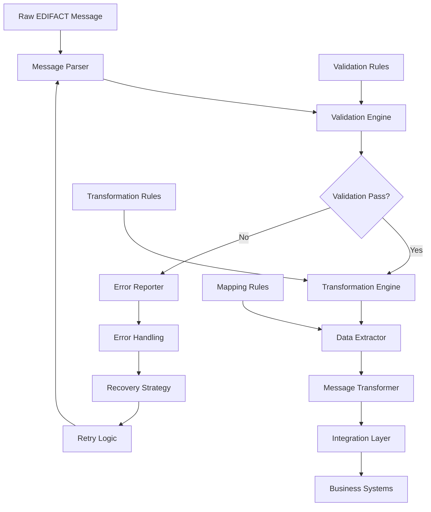

# Lesson 8: Advanced EDIFACT Processing

## 🎯 Learning Objectives

By the end of this lesson, you will understand:
- ✅ Advanced message transformation techniques
- ✅ Comprehensive validation frameworks
- ✅ Message integration patterns
- ✅ Data extraction and mapping strategies
- ✅ Error handling and reporting systems

## 🔍 Advanced EDIFACT Processing

This lesson covers sophisticated techniques for processing EDIFACT messages in production environments, including transformation, validation, and integration patterns that enable complex business workflows.

### Advanced Processing Capabilities

Advanced EDIFACT processing systems typically include:
- **Message Transformation**: Convert between different message types
- **Comprehensive Validation**: Multi-level validation with detailed reporting
- **Integration Patterns**: Seamless integration with business systems
- **Data Mapping**: Extract and map data between different formats
- **Error Handling**: Robust error handling with recovery mechanisms

## 🗺️ Mermaid Diagram: Advanced Processing Architecture



## 🔧 Advanced Processing Features

### 1. Message Transformation
```go
type MessageTransformer struct {
    transformers map[string]TransformFunc
}

func (mt *MessageTransformer) Transform(message *EDIFACTMessage) (*TransformedMessage, error) {
    if transformer, exists := mt.transformers[message.MessageType]; exists {
        return transformer(message)
    }
    return nil, fmt.Errorf("no transformer found for message type: %s", message.MessageType)
}
```

### 2. Comprehensive Validation
```go
type AdvancedValidator struct {
    rules map[string][]ValidationRule
}

func (av *AdvancedValidator) Validate(message *EDIFACTMessage) *ValidationResult {
    result := &ValidationResult{
        Valid:    true,
        Errors:   []ValidationError{},
        Warnings: []ValidationWarning{},
    }
    
    if rules, exists := av.rules[message.MessageType]; exists {
        for _, rule := range rules {
            if err := rule.Validate(message); err != nil {
                result.Valid = false
                result.Errors = append(result.Errors, ValidationError{
                    Rule:     rule.Name,
                    Message:  err.Error(),
                    Severity: "ERROR",
                })
            }
        }
    }
    
    return result
}
```

### 3. Data Extraction and Mapping
```go
func (mt *MessageTransformer) extractInvoiceData(message *EDIFACTMessage) *InvoiceData {
    invoice := &InvoiceData{
        Items: []InvoiceItem{},
    }
    
    for _, segment := range message.Segments {
        switch segment.Tag {
        case "BGM":
            if len(segment.Elements) > 1 {
                invoice.InvoiceNumber = segment.Elements[1]
            }
        case "DTM":
            if len(segment.Elements) > 0 {
                parts := strings.Split(segment.Elements[0], ":")
                if len(parts) > 1 {
                    invoice.InvoiceDate = parts[1]
                }
            }
        // ... more extraction logic
        }
    }
    
    return invoice
}
```

## 🛠️ Running the Examples

### Prerequisites
```bash
# Ensure you're in the lesson directory
cd examples/course/lesson8
```

### Basic Examples
```bash
# Run the main lesson
go run main.go
```

### What You'll See
The examples demonstrate:
- Message transformation between different types
- Comprehensive validation with detailed error reporting
- Data extraction and mapping techniques
- Integration patterns for business systems
- Error handling and recovery mechanisms

## 💡 Key Concepts Explained

### 1. Message Transformation
- **Type Conversion**: Convert between INVOIC, ORDERS, DESADV, etc.
- **Data Mapping**: Map fields between different message structures
- **Business Logic**: Apply business rules during transformation
- **Metadata Preservation**: Maintain transformation history and context

### 2. Validation Framework
- **Multi-Level Validation**: Syntax, structure, and business rule validation
- **Custom Rules**: Define organization-specific validation rules
- **Error Reporting**: Detailed error messages with context
- **Warning System**: Non-blocking validation warnings

### 3. Integration Patterns
- **Message Routing**: Route messages to appropriate handlers
- **Data Enrichment**: Add additional data from external sources
- **Transformation Pipelines**: Chain multiple transformations
- **Error Recovery**: Implement retry and fallback mechanisms

## 🧪 Practice Exercises

### Exercise 1: Custom Message Transformer
Create a transformer for a new message type:
```go
type CustomTransformer struct {
    // Your implementation here
}

func (ct *CustomTransformer) Transform(message *EDIFACTMessage) (*TransformedMessage, error) {
    // Extract data from source message
    // Apply transformation logic
    // Return transformed message
}
```

### Exercise 2: Advanced Validation Rules
Implement custom validation rules:
```go
func (av *AdvancedValidator) validateBusinessRules(message *EDIFACTMessage) error {
    // Check business-specific rules
    // Validate data relationships
    // Verify business constraints
}
```

### Exercise 3: Integration Pipeline
Build an integration pipeline:
```go
type IntegrationPipeline struct {
    steps []ProcessingStep
}

func (ip *IntegrationPipeline) Process(message *EDIFACTMessage) error {
    // Apply each processing step
    // Handle errors and rollback
    // Provide monitoring and logging
}
```

## ⚠️ Common Challenges

1. **Complex Transformations**: Handle complex data mapping scenarios
2. **Validation Performance**: Optimize validation for high-throughput systems
3. **Error Recovery**: Implement robust error recovery mechanisms
4. **Data Consistency**: Ensure data consistency across transformations

## 🔍 Troubleshooting

### Transformation Issues
- Verify transformation rules and mappings
- Check data extraction logic
- Validate business rule implementation
- Monitor transformation performance

### Validation Problems
- Review validation rule definitions
- Check error reporting accuracy
- Verify validation performance
- Test edge cases and error conditions

### Integration Issues
- Test integration endpoints
- Verify data flow between systems
- Check error handling and recovery
- Monitor system performance

## 📚 Next Steps

After completing this lesson:
1. Practice with real-world message types
2. Implement custom transformation rules
3. Build comprehensive validation frameworks
4. Design integration architectures
5. Explore advanced error handling patterns

## 🎯 Key Takeaways

- ✅ Message transformation enables flexible data processing
- ✅ Comprehensive validation ensures data quality
- ✅ Integration patterns connect EDI with business systems
- ✅ Data extraction and mapping are crucial for transformation
- ✅ Error handling and recovery ensure system reliability
- ✅ Advanced processing enables complex business workflows

---

*Congratulations! You've completed the advanced EDIFACT processing course! 🚀* 