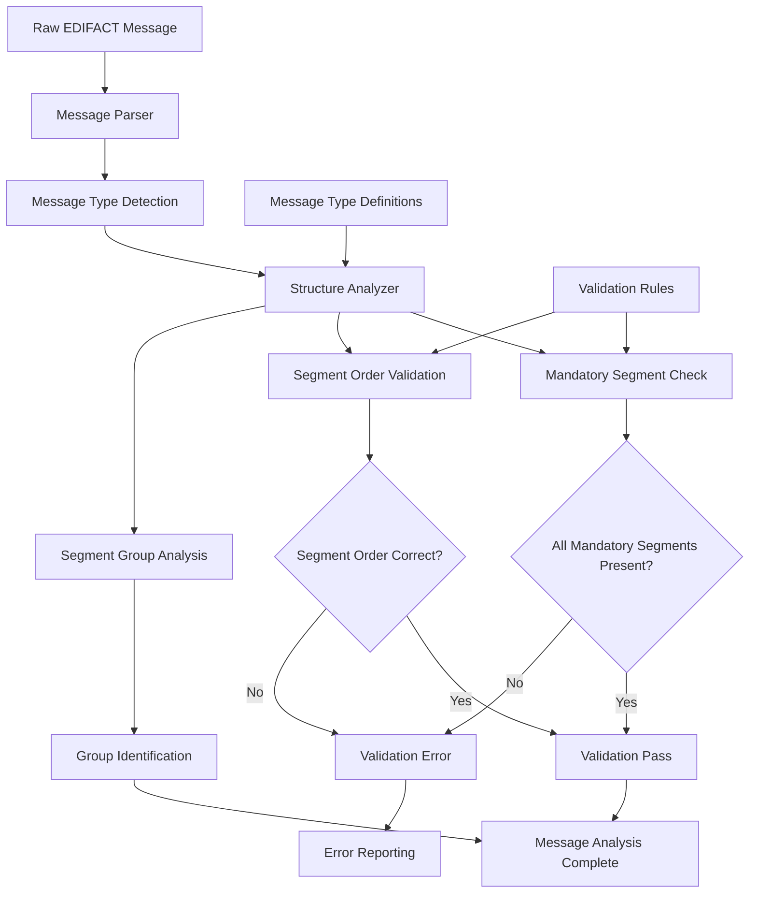

# Lesson 4: Message Structure

## 📚 Learning Objectives

By the end of this lesson, you will understand:
- ✅ EDIFACT message hierarchy and structure
- ✅ Segment groups and their relationships
- ✅ Mandatory vs conditional segments
- ✅ Message envelope and service segments

## 🔍 EDIFACT Message Structure

EDIFACT messages follow a strict hierarchical structure that ensures proper organization and processing of business data.

### Message Hierarchy

```
Interchange (UNB/UNZ)
├── Functional Group (UNG/UNE)
│   └── Message (UNH/UNT)
│       ├── Segment Group
│       │   ├── Trigger Segment
│       │   └── Dependent Segments
│       └── Individual Segments
└── Functional Group
```

## 🗺️ Mermaid Diagram: Message Structure Analysis



## 🎯 Message Components

### 1. Interchange Level
- **UNB** - Interchange Header
- **UNZ** - Interchange Trailer
- Contains sender/receiver information

### 2. Functional Group Level
- **UNG** - Functional Group Header
- **UNE** - Functional Group Trailer
- Groups related messages

### 3. Message Level
- **UNH** - Message Header
- **UNT** - Message Trailer
- Contains the actual business data

### 4. Data Segments
- Business data segments
- Organized in logical groups
- Follow specific sequence rules

## 📖 Segment Groups

Segment groups are logical collections of related segments that can repeat together.

### Group Structure
```
Segment Group 1
├── Trigger Segment (mandatory)
├── Dependent Segment 1 (conditional)
└── Dependent Segment 2 (conditional)

Segment Group 2
├── Trigger Segment (mandatory)
└── Dependent Segments (conditional)
```

### Example: Invoice Message Structure
```
UNH - Message Header
BGM - Beginning of Message
DTM - Date/Time
NAD - Name and Address (Buyer)
NAD - Name and Address (Seller)
LIN - Line Item (Group 1)
├── LIN - Line Item
├── QTY - Quantity
└── PRI - Price
LIN - Line Item (Group 1)
├── LIN - Line Item
├── QTY - Quantity
└── PRI - Price
UNT - Message Trailer
```

## 🔧 Running the Examples

### Prerequisites
```bash
# Ensure you're in the lesson directory
cd examples/fundamental_un_edifact/lesson4
```

### Basic Examples
```bash
# Run the main lesson
go run main.go
```

### What You'll See
The examples demonstrate:
- Message hierarchy analysis
- Segment group identification
- Mandatory/conditional segment validation
- Message structure validation
- Service segment handling

## 💡 Key Concepts Explained

### 1. Mandatory vs Conditional Segments
- **Mandatory**: Must be present for valid message
- **Conditional**: May be omitted based on business rules
- **Repeatable**: Can appear multiple times

### 2. Segment Group Rules
- Each group has a trigger segment
- Dependent segments follow the trigger
- Groups can repeat multiple times
- Groups can be nested

### 3. Message Envelope
- Service segments wrap the message
- Provide transmission control
- Include metadata about the message

## 🧪 Practice Exercises

### Exercise 1: Identify Message Structure
Analyze this message structure:
```
UNH+1+INVOIC:D:97A:UN'
BGM+380+12345678+9'
DTM+137:20231201:102'
NAD+BY+++ACME CORP'
NAD+SE+++SUPPLIER INC'
LIN+1++1234567890123:EN'
QTY+12:100:PCE'
PRI+AAA:25.50:CT'
LIN+2++9876543210987:EN'
QTY+12:50:PCE'
PRI+AAA:30.00:CT'
UNT+12+1'
```

**Answer**:
- UNH/UNT: Message envelope
- BGM: Beginning of message (mandatory)
- DTM: Date/time (conditional)
- NAD: Name/address segments (conditional, repeatable)
- LIN groups: Line items (repeatable group)
  - LIN: Trigger segment
  - QTY: Dependent segment
  - PRI: Dependent segment

### Exercise 2: Segment Group Analysis
How many segment groups are in this message?
```
UNH+1+INVOIC:D:97A:UN'
BGM+380+12345678+9'
NAD+BY+++BUYER'
NAD+SE+++SELLER'
LIN+1++ITEM1:EN'
QTY+12:100:PCE'
PRI+AAA:25.50:CT'
LIN+2++ITEM2:EN'
QTY+12:50:PCE'
PRI+AAA:30.00:CT'
UNT+10+1'
```

**Answer**: 2 segment groups (LIN groups)

### Exercise 3: Mandatory Segment Check
Which segments are mandatory in an INVOIC message?
```
UNH+1+INVOIC:D:97A:UN'
BGM+380+12345678+9'
DTM+137:20231201:102'
NAD+BY+++BUYER'
LIN+1++ITEM1:EN'
QTY+12:100:PCE'
UNT+7+1'
```

**Answer**: UNH, BGM, and UNT are mandatory. DTM, NAD, LIN, and QTY are conditional.

## ⚠️ Common Mistakes

1. **Wrong Segment Order**: Not following the correct sequence
2. **Missing Mandatory Segments**: Omitting required segments
3. **Incorrect Group Structure**: Not properly organizing segment groups
4. **Wrong Message Count**: Incorrect segment count in UNT

## 🔍 Troubleshooting

### Structure Issues
- Verify segment sequence
- Check mandatory segment presence
- Validate segment group structure
- Ensure proper message envelope

### Validation Problems
- Segment count validation
- Group structure validation
- Mandatory segment validation
- Sequence rule validation

## 📚 Next Steps

After completing this lesson:
1. Practice analyzing message structures
2. Learn common segment sequences
3. Understand group relationships
4. Move to Lesson 5: Syntax Validation

## 🎯 Key Takeaways

- ✅ EDIFACT messages have a strict hierarchical structure
- ✅ Segment groups organize related data
- ✅ Mandatory segments must be present
- ✅ Service segments provide message envelope
- ✅ Understanding structure is crucial for validation

---

*Ready for the next lesson? Let's learn about syntax validation! 🚀* 