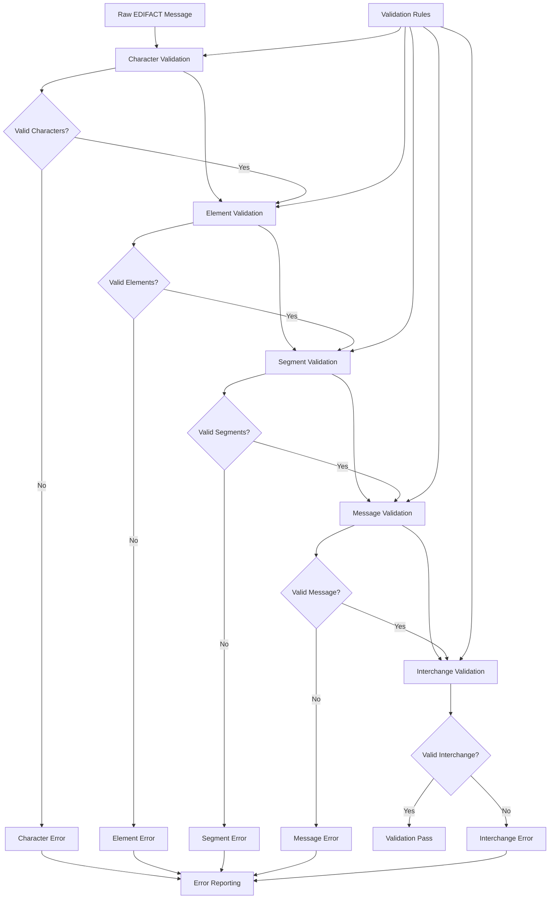

# Lesson 5: Syntax Validation

## 📚 Learning Objectives

By the end of this lesson, you will understand:
- ✅ EDIFACT syntax validation rules and requirements
- ✅ Error detection and reporting techniques
- ✅ Compliance checking and standards validation
- ✅ Common validation scenarios and solutions

## 🔍 What is EDIFACT Syntax Validation?

Syntax validation ensures that EDIFACT messages conform to the UN/EDIFACT standard rules and can be properly processed by receiving systems.

### Validation Levels

1. **Character Level**: Valid characters and encoding
2. **Element Level**: Data element format and content
3. **Segment Level**: Segment structure and syntax
4. **Message Level**: Message structure and sequence
5. **Interchange Level**: Complete interchange validation

## 🗺️ Mermaid Diagram: Syntax Validation Flow



## 🎯 Validation Rules

### 1. Character Validation
- Valid character set (UNOA, UNOB, UNOC, etc.)
- Proper delimiter usage
- Character escaping for special characters
- Line break and formatting restrictions

### 2. Element Validation
- Element length limits
- Data type validation
- Format code compliance
- Qualifier code validation

### 3. Segment Validation
- Segment tag validity
- Element count validation
- Mandatory element presence
- Element sequence validation

### 4. Message Validation
- Service segment presence
- Segment sequence rules
- Group structure validation
- Message count accuracy

## 📖 Common Validation Errors

### Syntax Errors
```
UNH+1+INVOIC:D:97A:UN    # Missing segment terminator
UNH+1+INVOIC:D:97A:UN+'  # Extra delimiter
UNH+1+INVOIC:D:97A:UN'   # Valid
```

### Structure Errors
```
UNH+1+INVOIC:D:97A:UN'
UNT+8+1'                 # Wrong segment count
BGM+380+12345678+9'      # Missing mandatory segments
```

### Content Errors
```
DTM+137:20231301:102'    # Invalid date (month 13)
QTY+12:-5:PCE'           # Invalid quantity (negative)
NAD+XX+++COMPANY'        # Unknown qualifier (XX)
```

## 🔧 Running the Examples

### Prerequisites
```bash
# Ensure you're in the lesson directory
cd examples/fundamental_un_edifact/lesson5
```

### Basic Examples
```bash
# Run the main lesson
go run main.go
```

### What You'll See
The examples demonstrate:
- Syntax validation techniques
- Error detection and reporting
- Compliance checking
- Validation rule implementation
- Error correction suggestions

## 💡 Key Concepts Explained

### 1. Validation Phases
- **Pre-processing**: Character and encoding validation
- **Parsing**: Structure and syntax validation
- **Semantic**: Business rule validation
- **Post-processing**: Final compliance check

### 2. Error Reporting
- **Error Code**: Standard error identifier
- **Error Description**: Human-readable message
- **Error Location**: Segment, element, and position
- **Severity Level**: Error, warning, or info

### 3. Compliance Levels
- **Strict**: All rules must be followed
- **Relaxed**: Some minor violations allowed
- **Custom**: Organization-specific rules

## 🧪 Practice Exercises

### Exercise 1: Identify Syntax Errors
Find the syntax errors in this message:
```
UNH+1+INVOIC:D:97A:UN
BGM+380+12345678+9'
DTM+137:20231301:102'
NAD+BY+++ACME CORP'
UNT+5+1'
```

**Answer**:
- UNH missing segment terminator (`'`)
- DTM has invalid date (month 13)
- UNT has wrong segment count (should be 4, not 5)

### Exercise 2: Validate Element Content
Check these elements for validity:
```
DTM+137:20231201:102'    # Date element
QTY+12:100:PCE'          # Quantity element
NAD+XX+++COMPANY'        # Name/address element
```

**Answer**:
- DTM: Valid
- QTY: Valid
- NAD: Invalid qualifier (XX is unknown)

### Exercise 3: Structure Validation
Validate this message structure:
```
UNH+1+INVOIC:D:97A:UN'
BGM+380+12345678+9'
LIN+1++ITEM1:EN'
QTY+12:100:PCE'
UNT+4+1'
```

**Answer**: Valid structure with correct segment count

## ⚠️ Common Mistakes

1. **Missing Terminators**: Forgetting segment terminators
2. **Wrong Delimiters**: Using incorrect delimiter characters
3. **Invalid Dates**: Incorrect date formats or values
4. **Unknown Codes**: Using undefined qualifiers or format codes

## 🔍 Troubleshooting

### Validation Issues
- Check character encoding
- Verify delimiter usage
- Validate element content
- Confirm segment structure

### Error Resolution
- Identify error location
- Understand error cause
- Apply correction rules
- Re-validate after fixes

## 📚 Next Steps

After completing this lesson:
1. Practice validation techniques
2. Learn error correction methods
3. Understand compliance requirements
4. Move to Lesson 6: Service Segments

## 🎯 Key Takeaways

- ✅ Syntax validation ensures EDIFACT compliance
- ✅ Multiple validation levels provide comprehensive checking
- ✅ Error reporting helps identify and fix issues
- ✅ Understanding validation rules is crucial for quality
- ✅ Proper validation prevents processing errors

---

*Ready for the next lesson? Let's explore service segments! 🚀* 