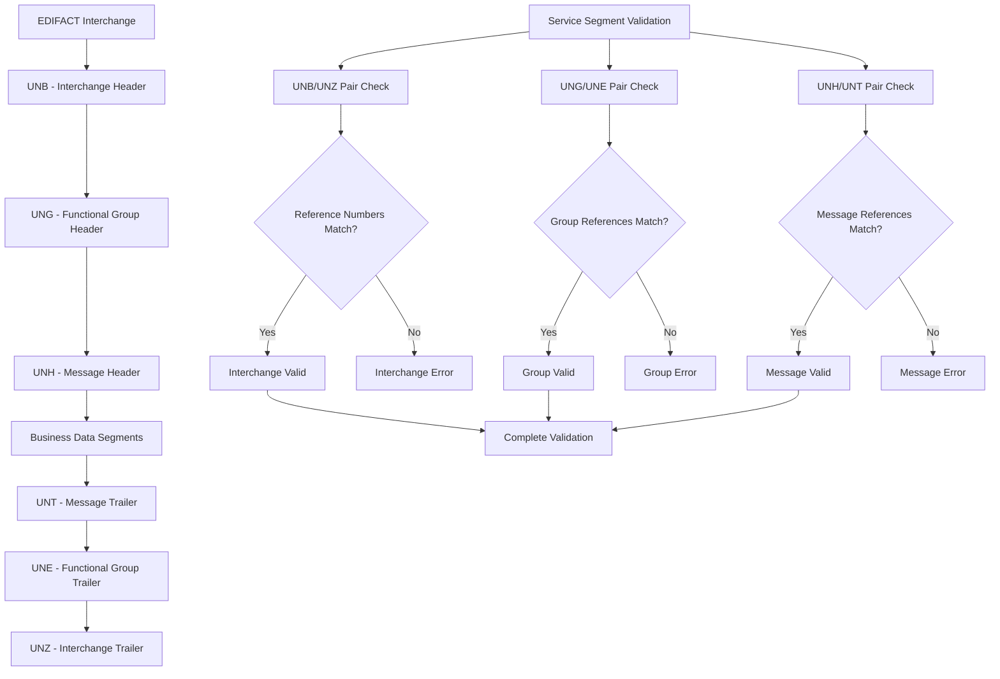

# Lesson 6: Service Segments

## 📚 Learning Objectives

By the end of this lesson, you will understand:
- ✅ Service segment types and purposes
- ✅ Message envelope structure (UNH/UNT)
- ✅ Interchange envelope structure (UNB/UNZ)
- ✅ Functional group structure (UNG/UNE)

## 🔍 What are Service Segments?

Service segments are special segments that control the structure, transmission, and processing of EDIFACT messages. They form the "envelope" around the business data.

### Service Segment Categories

1. **Interchange Level**: UNB/UNZ - Complete interchange control
2. **Functional Group Level**: UNG/UNE - Group of related messages
3. **Message Level**: UNH/UNT - Individual message control

## 🗺️ Mermaid Diagram: Service Segment Hierarchy



## 🎯 Message Level Service Segments

### UNH - Message Header
```
UNH+1+INVOIC:D:97A:UN'
     ^  ^      ^ ^  ^
     |  |      | |  └── Controlling agency
     |  |      | └── Version
     |  |      └── Release
     |  └── Message type
     └── Message reference number
```

**Purpose**: Identifies and describes the message content

### UNT - Message Trailer
```
UNT+8+1'
     ^ ^
     | └── Message reference number (matches UNH)
     └── Segment count (excluding UNH/UNT)
```

**Purpose**: Confirms message completion and provides count

## 📖 Interchange Level Service Segments

### UNB - Interchange Header
```
UNB+UNOA:2+SENDER+RECEIVER+231201:1430+12345+++INVOIC'
      ^    ^  ^      ^        ^      ^    ^   ^
      |    |  |      |        |      |    |   └── Message type
      |    |  |      |        |      |    └── Application password
      |    |  |      |        |      └── Interchange control reference
      |    |  |      |        └── Time
      |    |  |      └── Date
      |    |  └── Receiver identification
      |    └── Sender identification
      └── Syntax identifier
```

**Purpose**: Identifies sender, receiver, and transmission details

### UNZ - Interchange Trailer
```
UNZ+1+12345'
     ^ ^
     | └── Interchange control reference (matches UNB)
     └── Message count
```

**Purpose**: Confirms interchange completion and provides count

## 🔧 Running the Examples

### Prerequisites
```bash
# Ensure you're in the lesson directory
cd examples/fundamental_un_edifact/lesson6
```

### Basic Examples
```bash
# Run the main lesson
go run main.go
```

### What You'll See
The examples demonstrate:
- Service segment parsing and validation
- Message envelope construction
- Interchange envelope handling
- Segment count validation
- Reference number matching

## 💡 Key Concepts Explained

### 1. Message Envelope
- **UNH**: Message header with metadata
- **UNT**: Message trailer with count
- **Reference Matching**: UNH and UNT reference numbers must match

### 2. Interchange Envelope
- **UNB**: Interchange header with transmission details
- **UNZ**: Interchange trailer with message count
- **Control Reference**: UNB and UNZ references must match

### 3. Functional Group Envelope
- **UNG**: Functional group header
- **UNE**: Functional group trailer
- **Group Control**: Groups related messages together

## 🧪 Practice Exercises

### Exercise 1: Parse Message Header
Analyze this UNH segment:
```
UNH+1+INVOIC:D:97A:UN'
```

**Answer**:
- Reference: 1
- Message Type: INVOIC (Invoice)
- Release: D
- Version: 97A
- Agency: UN

### Exercise 2: Validate Message Trailer
Check if this UNT matches the UNH:
```
UNH+1+INVOIC:D:97A:UN'
BGM+380+12345678+9'
DTM+137:20231201:102'
NAD+BY+++ACME CORP'
UNT+4+1'
```

**Answer**: Valid - reference numbers match (1) and segment count is correct (4)

### Exercise 3: Interchange Validation
Validate this interchange:
```
UNB+UNOA:2+SENDER+RECEIVER+231201:1430+12345+++INVOIC'
UNH+1+INVOIC:D:97A:UN'
BGM+380+12345678+9'
UNT+2+1'
UNZ+1+12345'
```

**Answer**: Valid interchange with matching references and correct counts

## ⚠️ Common Mistakes

1. **Mismatched References**: UNH/UNT or UNB/UNZ reference numbers don't match
2. **Wrong Segment Count**: UNT or UNZ count doesn't match actual segments
3. **Missing Service Segments**: Required service segments are omitted
4. **Invalid Syntax**: Incorrect syntax identifier or version codes

## 🔍 Troubleshooting

### Service Segment Issues
- Verify reference number matching
- Check segment count accuracy
- Validate syntax identifiers
- Confirm version and release codes

### Envelope Problems
- Missing or malformed headers/trailers
- Incorrect control references
- Invalid transmission details
- Wrong message type specifications

## 📚 Next Steps

After completing this lesson:
1. Practice service segment parsing
2. Learn envelope construction
3. Understand transmission control
4. Move to Lesson 7: Data Element Types

## 🎯 Key Takeaways

- ✅ Service segments control message structure and transmission
- ✅ Message envelope (UNH/UNT) wraps individual messages
- ✅ Interchange envelope (UNB/UNZ) controls complete transmissions
- ✅ Reference numbers must match between headers and trailers
- ✅ Segment counts must be accurate for validation

---

*Ready for the next lesson? Let's explore data element types! 🚀* 