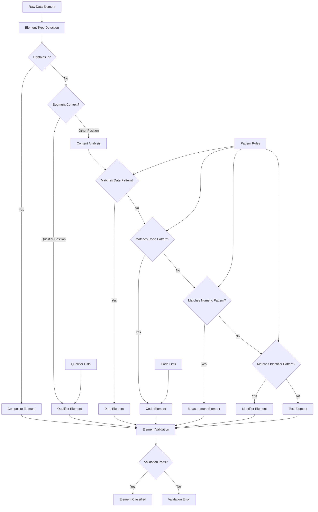

# Lesson 7: Data Element Types

## 📚 Learning Objectives

By the end of this lesson, you will understand:
- ✅ Different types of EDIFACT data elements
- ✅ Qualifiers and their classification system
- ✅ Codes and code lists in EDIFACT
- ✅ Measurements, dates, and text elements

## 🔍 EDIFACT Data Element Types

EDIFACT data elements are classified into different types based on their content and purpose. Understanding these types is crucial for proper data interpretation and validation.

### Element Type Categories

1. **Qualifiers**: Define the meaning of other elements
2. **Codes**: Standardized values from code lists
3. **Measurements**: Quantities with units
4. **Dates and Times**: Temporal information
5. **Text**: Free-form textual data
6. **Identifiers**: Unique identification codes

## 🗺️ Mermaid Diagram: Data Element Classification Flow



## 🎯 Qualifiers

Qualifiers are codes that define the meaning or context of other data elements.

### Common Qualifier Types

#### Party Qualifiers (NAD segment)
```
BY - Buyer
SE - Seller
SU - Supplier
CA - Carrier
```

#### Date/Time Qualifiers (DTM segment)
```
137 - Document/message date/time
2 - Delivery date/time
35 - Time
```

#### Quantity Qualifiers (QTY segment)
```
12 - Number of packages
145 - Gross weight
146 - Volume
```

#### Reference Qualifiers (RFF segment)
```
CT - Contract number
IV - Invoice number
PO - Purchase order number
```

## 📖 Codes and Code Lists

EDIFACT uses standardized code lists to ensure consistent data interpretation.

### Message Type Codes
```
INVOIC - Invoice
ORDERS - Purchase Order
DESADV - Despatch Advice
INVRPT - Inventory Report
```

### Document Type Codes (BGM segment)
```
380 - Commercial Invoice
325 - Pro-forma Invoice
384 - Consignment Invoice
```

### Unit Codes (QTY segment)
```
PCE - Pieces
KGM - Kilograms
LTR - Liters
MTR - Meters
```

## 🔧 Running the Examples

### Prerequisites
```bash
# Ensure you're in the lesson directory
cd examples/fundamental_un_edifact/lesson7
```

### Basic Examples
```bash
# Run the main lesson
go run main.go
```

### What You'll See
The examples demonstrate:
- Element type classification
- Qualifier interpretation
- Code list validation
- Measurement handling
- Date/time processing

## 💡 Key Concepts Explained

### 1. Element Classification
- **Simple**: Single value elements
- **Composite**: Multiple component elements
- **Empty**: No value (represented by consecutive delimiters)

### 2. Data Validation
- **Qualifier Validation**: Check against known qualifier lists
- **Code Validation**: Verify against standard code lists
- **Format Validation**: Ensure proper data format
- **Range Validation**: Check value ranges where applicable

### 3. Element Relationships
- **Qualifier-Value Pairs**: Qualifiers define value meaning
- **Code-Description Mapping**: Codes have standard descriptions
- **Unit-Quantity Pairs**: Quantities require unit specification

## 🧪 Practice Exercises

### Exercise 1: Identify Element Types
Classify these elements by type:
```
DTM+137:20231201:102'    # Date/time
QTY+12:100:PCE'          # Quantity
NAD+BY+++ACME CORP'      # Name/address
RFF+CT:123456'           # Reference
```

**Answer**:
- DTM: Date/time element with qualifier (137)
- QTY: Quantity element with qualifier (12) and unit (PCE)
- NAD: Name/address with party qualifier (BY)
- RFF: Reference with qualifier (CT)

### Exercise 2: Qualifier Interpretation
What do these qualifiers mean?
```
DTM+137:20231201:102'    # 137
DTM+2:20231201:102'      # 2
QTY+12:100:PCE'          # 12
NAD+BY+++COMPANY'        # BY
```

**Answer**:
- 137: Document/message date/time
- 2: Delivery date/time
- 12: Number of packages
- BY: Buyer

### Exercise 3: Code Validation
Validate these codes:
```
BGM+380+12345678+9'      # 380
QTY+12:100:PCE'          # PCE
NAD+XX+++COMPANY'        # XX
```

**Answer**:
- 380: Valid (Commercial Invoice)
- PCE: Valid (Pieces)
- XX: Invalid (unknown party qualifier)

## ⚠️ Common Mistakes

1. **Unknown Qualifiers**: Using undefined qualifier codes
2. **Invalid Codes**: Using codes not in standard lists
3. **Missing Units**: Quantities without unit specification
4. **Wrong Formats**: Incorrect date/time or measurement formats

## 🔍 Troubleshooting

### Element Type Issues
- Verify qualifier against standard lists
- Check code validity in code lists
- Validate measurement units
- Confirm date/time formats

### Validation Problems
- Unknown qualifier codes
- Invalid format codes
- Missing required components
- Out-of-range values

## 📚 Next Steps

After completing this lesson:
1. Practice element type classification
2. Learn common qualifier codes
3. Understand code list validation
4. Move to Lesson 8: Advanced Syntax

## 🎯 Key Takeaways

- ✅ EDIFACT elements are classified by type and purpose
- ✅ Qualifiers define the meaning of other elements
- ✅ Codes come from standardized code lists
- ✅ Understanding element types is crucial for validation
- ✅ Proper classification enables accurate data interpretation

---

*Ready for the final lesson? Let's explore advanced syntax concepts! 🚀* 