# บทที่ 2: ส่วนประกอบ Segment และ Element

## 🎯 เป้าหมายการเรียนรู้
- เข้าใจโครงสร้าง Segment และ Element ใน EDIFACT
- แยก element/simple/composite ได้
- วิเคราะห์ตำแหน่งและชนิดข้อมูลใน segment

## 🧩 โครงสร้าง Segment
- Segment = กลุ่มข้อมูล เช่น UNH, BGM, DTM
- Element = ข้อมูลย่อยใน segment (simple/composite)
- Composite = element ที่มีหลายค่าคั่นด้วย `:`

### ตัวอย่าง
```
UNH+1+INVOIC:D:97A:UN'
BGM+380+12345678+9'
DTM+137:20231201:102'
```

## 🗺️ Mermaid Diagram: โครงสร้าง Segment

```mermaid
flowchart LR
  A["Segment (เช่น UNH)"] --> B["Element 1 (เช่น 1)"]
  A --> C["Element 2 (เช่น INVOIC:D:97A:UN)"]
  C --> D["Component 1 (INVOIC)"]
  C --> E["Component 2 (D)"]
  C --> F["Component 3 (97A)"]
  C --> G["Component 4 (UN)"]
```


## 🛠️ ทดลองรันโค้ด
ดูตัวอย่างใน `main.go` แล้วรัน:
```bash
cd lesson2_segment_element
go run main.go
```

## 📝 แบบฝึกหัด
1. ข้อความนี้มี element กี่ตัว? `BGM+380+12345678+9'`
2. element ใดเป็น composite?
3. ลองเปลี่ยนค่าของ element แล้วสังเกตผลลัพธ์

## 🔑 สรุป
- Segment คือกลุ่มข้อมูลหลัก
- Element คือข้อมูลย่อยใน segment
- Composite คือ element ที่มีหลาย component
- เข้าใจโครงสร้างนี้จะช่วยให้ parse ข้อมูล EDIFACT ได้ถูกต้อง 