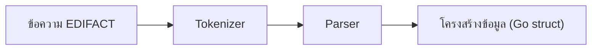

# บทที่ 3: การแยกวิเคราะห์ข้อความ EDIFACT

## 🎯 เป้าหมายการเรียนรู้
- เข้าใจหลักการ parse ข้อความ EDIFACT
- ใช้ tokenizer และ parser แยก segment/element/composite
- เห็น flow การแปลงข้อความเป็นโครงสร้างข้อมูล

## 🛠️ หลักการแยกวิเคราะห์ (Parsing)
- Tokenizer: แยกข้อความเป็น segment/element/component
- Parser: สร้างโครงสร้างข้อมูลจาก token

### ตัวอย่างข้อความ
```
UNH+1+INVOIC:D:97A:UN'BGM+380+12345678+9'DTM+137:20231201:102'
```

## 🗺️ Mermaid Diagram: Parsing Flow


## 🛠️ ทดลองรันโค้ด
ดูตัวอย่างใน `main.go` แล้วรัน:
```bash
cd lesson3_parse_message
go run main.go
```

## 📝 แบบฝึกหัด
1. อธิบายหน้าที่ของ tokenizer และ parser
2. ลองเปลี่ยนข้อความ input แล้วดูผลลัพธ์
3. วาด flowchart การ parse ข้อมูลด้วยตัวเอง

## 🔑 สรุป
- การ parse คือการแปลงข้อความเป็นโครงสร้างข้อมูล
- Tokenizer แยกข้อความเป็นส่วนย่อย
- Parser สร้างโครงสร้างข้อมูลจาก token 