# บทที่ 4: การตรวจจับและแปลงข้อความด้วย looksocial/edifact

## 🎯 เป้าหมายการเรียนรู้
- ใช้ package looksocial/edifact ตรวจจับและแปลงข้อความ EDIFACT
- เข้าใจ flow การ detect/convert
- เห็นตัวอย่างการแปลงเป็น JSON/struct

## 🛠️ การใช้งานเบื้องต้น
- ใช้ฟังก์ชัน Detect/Convert จาก package
- แปลงข้อความ EDIFACT เป็นโครงสร้างข้อมูล Go หรือ JSON

### ตัวอย่าง
```go
import "github.com/looksocial/edifact/pkg/edifact"
reader := edifact.NewReader(strings.NewReader(msg))
msgObj, _ := reader.ReadMessage()
jsonData, _ := edifact.ConvertToJSON(msgObj)
```

## 🗺️ Mermaid Diagram: Detect & Convert Flow

```mermaid
flowchart LR
  A["ข้อความ EDIFACT"] --> B["edifact.Reader"]
  B --> C["ReadMessage"]
  C --> D["ConvertToJSON"]
  D --> E["JSON/Struct"]
```


## 🛠️ ทดลองรันโค้ด
ดูตัวอย่างใน `main.go` แล้วรัน:
```bash
cd lesson4_detect_convert
go run main.go
```

## 📝 แบบฝึกหัด
1. อธิบายขั้นตอนการ detect และ convert
2. ลองแปลงข้อความ EDIFACT อื่นๆ เป็น JSON
3. เปรียบเทียบโครงสร้างข้อมูลก่อน/หลังแปลง

## 🔑 สรุป
- ใช้ looksocial/edifact แปลง EDIFACT เป็น JSON/struct ได้ง่าย
- เข้าใจ flow การ detect/convert 