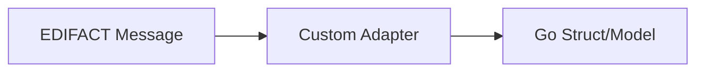

# บทที่ 5: การสร้าง Custom Adapter

## 🎯 เป้าหมายการเรียนรู้
- สร้าง adapter สำหรับแปลง EDIFACT เป็นโครงสร้างข้อมูลที่ต้องการ
- เข้าใจการ map ข้อมูลจาก segment/element ไปยัง struct/model
- เห็น flow การสร้าง adapter

## 🛠️ หลักการสร้าง Adapter
- รับข้อมูล EDIFACT (segment/element)
- map ข้อมูลไปยัง field ของ struct/model
- คืนค่า struct/model ที่พร้อมใช้งาน

### ตัวอย่าง
```go
type Invoice struct {
	Number string
	Date   string
	Amount string
}
// ... map จาก segment BGM, DTM, QTY ไปยัง Invoice
```

## 🗺️ Mermaid Diagram: Adapter Flow


## 🛠️ ทดลองรันโค้ด
ดูตัวอย่างใน `main.go` แล้วรัน:
```bash
cd lesson5_custom_adapter
go run main.go
```

## 📝 แบบฝึกหัด
1. สร้าง struct ใหม่สำหรับข้อมูลที่ต้องการ
2. map ข้อมูลจาก segment/element ไปยัง struct
3. print struct ที่ได้ออกมาดู

## 🔑 สรุป
- Adapter ช่วยแปลง EDIFACT เป็นโครงสร้างที่ใช้งานง่าย
- สามารถ custom ได้ตาม use case จริง 