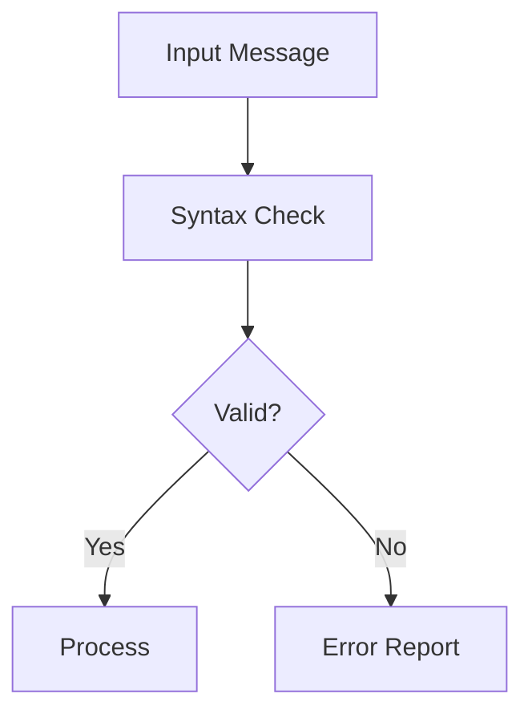

# บทที่ 6: การตรวจสอบความถูกต้องของข้อความ

## 🎯 เป้าหมายการเรียนรู้
- ตรวจสอบความถูกต้องของข้อความ EDIFACT
- เข้าใจหลักการ validation
- เห็น flow การตรวจสอบและรายงาน error

## 🛠️ หลักการ Validation
- ตรวจสอบ delimiter, segment, element, composite
- ตรวจสอบรูปแบบข้อมูล (format, code, date)
- รายงาน error หากพบข้อมูลผิด

### ตัวอย่าง
- ขาด segment terminator `'`
- วันที่ผิดรูปแบบ (20231301)
- code ไม่ถูกต้อง

## 🗺️ Mermaid Diagram: Validation Flow


## 🛠️ ทดลองรันโค้ด
ดูตัวอย่างใน `main.go` แล้วรัน:
```bash
cd lesson6_validation
go run main.go
```

## 📝 แบบฝึกหัด
1. ลองแก้ไขข้อความให้ผิดรูปแบบ แล้วดู error
2. เพิ่ม validation สำหรับ code/date/format
3. รายงาน error ที่พบออกทางหน้าจอ

## 🔑 สรุป
- Validation สำคัญต่อความถูกต้องของข้อมูล
- สามารถ custom rule ได้ตาม use case 