# บทที่ 7: ประยุกต์ใช้กับกรณีจริง

## 🎯 เป้าหมายการเรียนรู้
- นำความรู้ EDIFACT และ looksocial/edifact ไปใช้กับ use case จริง
- เห็นตัวอย่างการประยุกต์ใช้ในธุรกิจ
- เข้าใจ flow การประมวลผลข้อมูลจริง

## 🛠️ ตัวอย่าง use case
- รับข้อความ EDIFACT จากระบบภายนอก
- แปลงเป็น JSON/struct
- ตรวจสอบและ map ข้อมูลไปยังฐานข้อมูล

### ตัวอย่าง flow
1. รับข้อความ EDIFACT
2. แปลงเป็นโครงสร้างข้อมูล Go
3. ตรวจสอบความถูกต้อง
4. map ข้อมูลไปยัง model/database

## 🗺️ Mermaid Diagram: Real-world Flow

```mermaid
flowchart TD
  A["รับข้อความ EDIFACT"] --> B["แปลงเป็น Go struct"]
  B --> C["ตรวจสอบความถูกต้อง"]
  C --> D["map ไปยังฐานข้อมูล/ระบบงาน"]
```


## 🛠️ ทดลองรันโค้ด
ดูตัวอย่างใน `main.go` แล้วรัน:
```bash
cd lesson7_apply_realworld
go run main.go
```

## 📝 แบบฝึกหัด
1. ลองรับ input จากไฟล์หรือ stdin
2. map ข้อมูลไปยัง struct/database จริง
3. ประยุกต์ใช้กับ use case ของคุณเอง

## 🔑 สรุป
- สามารถนำความรู้ไปใช้กับงานจริงได้
- ปรับแต่ง flow ได้ตามความต้องการ 