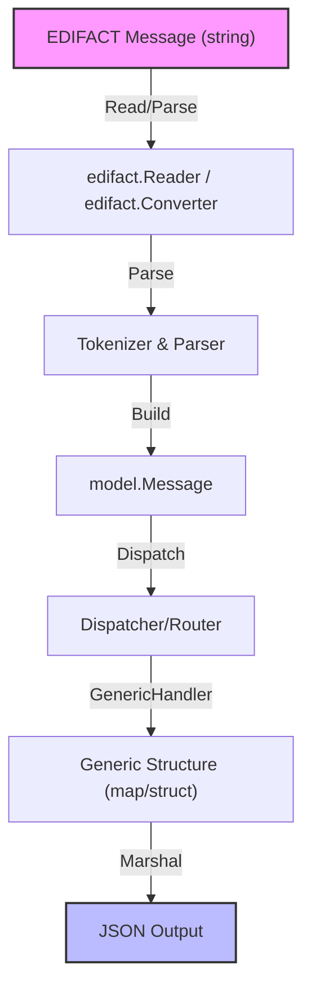

# Basic Example: EDIFACT to JSON

This example demonstrates how to use the `edifact` package to convert an EDIFACT message to JSON using the generic handler.

## Flow Diagram

## Usage

See `main.go` for runnable code. 