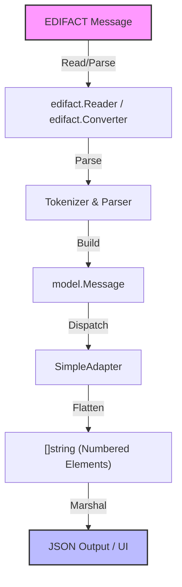

# Simple Adapter Example: Flat Elements Output

This example demonstrates how to use a simple adapter to convert any EDIFACT message to a flat, numbered list of elements.

## Flow Diagram

## Usage

See `main.go` for runnable code and element access examples. 